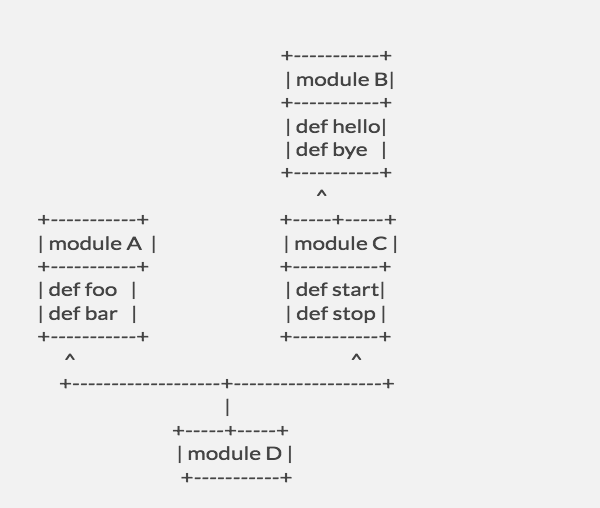
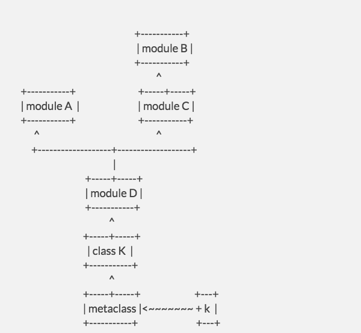
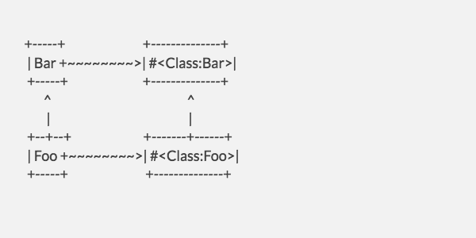
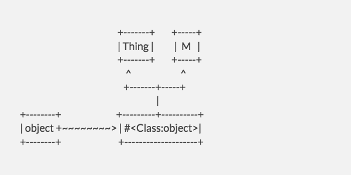
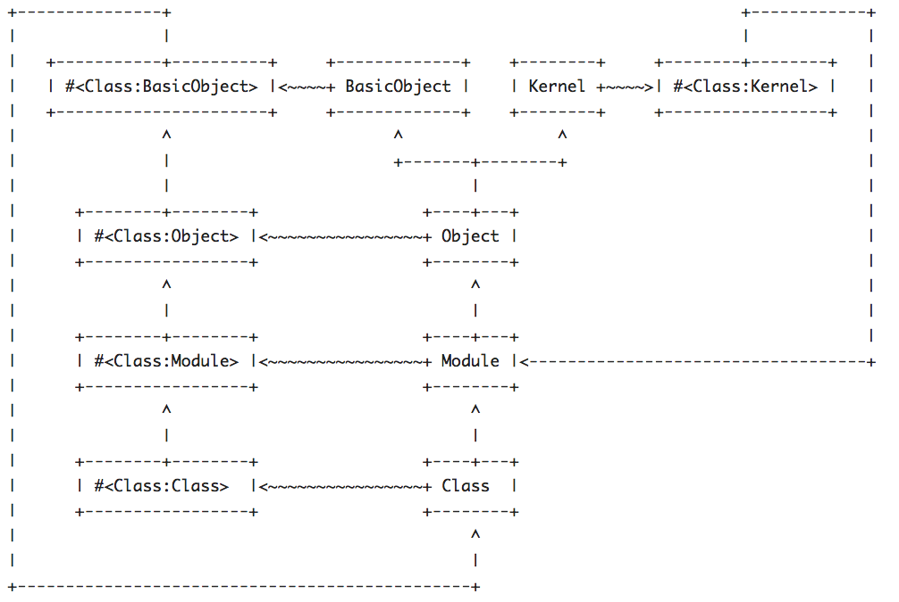

## Ruby Modules

You can build almost all of `Ruby’s object system` out of `Module`. Think of a `module` as a `bag of methods`. For example, module `A` contains methods `foo` and `bar`.

| module A |
|:---------:|
|   def foo  |
|   def bar  |

When you write `def foo ... end` inside a `Ruby module`, you are `adding that method` to the` module`, that’s all. Now, a module can have `any number` of `parents`. When you write:

```ruby
module B
  include A
end
```

all you are doing is adding `A` as a `parent` of `B`. `No methods are copied`, we just create a `pointer` from `B to A`.

| module A |
|:---------:|
|   def foo  |
|   def bar  |
		
^   
|

| module B   |
|:----------: |
|   def hello  |
|   def bye    |


Now, a module can have many parents, and they form a tree. Take these modules:

```ruby
module A
  def foo ; end
  def bar ; end
end

module B
  def hello ; end
  def bye ; end
end

module C
  include B
  def start ; end
  def stop ; end
end

module D
  include A
  include C
end
```

These form a tree like this, following their include relationships:




An important concept that affects how methods are dispatched is a `module’s ancestry`. You can ask a module for its `ancestors` and it will give you an `array of modules`:

```ruby
>> D.ancestors
=> [D, C, B, A]
```

The important thing about this list is that it’s `flat`, rather than being `a tree`. It determines the `order that we search modules` in to `find a method`.
To build this list, we start at `D` and run a `depth-first right-to-left search` of its tree. This is why the order of `include calls` is important: a `module’s parents` are `ordered` and this determines the `order they are searched in`.

When we want to `dispatch a method`, we look at each one of a `module’s ancestors` in turn, and stop at the `first module` that contains a method with the name we want. If `none of the modules` contain this method, we perform the `search again` but this time looking for the method called `method_missing`. If `none of the modules` contain that method, we throw a `NoMethodError`. The `order of the ancestry` resolves cases where `two modules` contain the `same method`: whichever comes `earlier` in the `ancestors array` wins.

We can use Ruby’s reflection capabilities to find out which method will be used when we invoke certain names:
```ruby
>> D.instance_method(:foo)
=> #<UnboundMethod: D(A)#foo>

>> D.instance_method(:hello)
=> #<UnboundMethod: D(B)#hello>

>> D.instance_method(:start)
=> #<UnboundMethod: D(C)#start>
```

An `UnboundMethod` is just an `object` representing a `method from a module`, before it’s been `bound to an object`. When you see `D(A)#foo`, it means `D` has `inherited` the `#foo` method from `A`. If you dispatch `#foo` to an object that includes `D`, you’ll get the method defined in `A`.

Speaking of `objects`, why haven’t we made any yet? What good is a bag of methods will `no objects` to `invoke them` on? Well, that’s where `Class` comes in. In Ruby, `Class` is a `subclass` of `Module`, which sounds weird but just remember they’re `data structures` that `hold methods`. A `Class` is like a `Module`, in that it’s a thing that `stores methods` and can `include other modules`, but it also has some `additional capabilities`, the first of which is that it can `create objects`.
```ruby
class K
  include D
end

k = K.new
```

Again, we can use reflection to see where each of the object’s methods come from:
```ruby
>> k.method(:start)
=> #<Method: K(C)#start>
```

This shows that when we invoke `k.start`, we’ll get the `#start` method from `module C`. You’ll notice that while calling `instance_method` on a `module` gets us an `UnboundMethod`, calling `method` on an `Object` gets us a `Method`. The `difference` is that a `Method is bound to an object`; it’s a `callable` that, when you invoke `#call` on it, will do the same thing as calling `k.start`. `UnboundMethods` cannot be `called directly` since they have `no object` to be `invoked on`.


So it looks like we dispatch method calls by `finding the class` the `object belongs to`, then `looking through` that `class’s ancestors` until we find a `matching method`. Well, that’s almost true, but `Ruby` has another `trick` up its sleeve: `singleton methods`. You can add `new methods` to `any object`, and `only that object`, `without adding them to a class`. See:

```ruby
>> def k.mart ; end

>> k.method(:mart)
=> #<Method: #<K:0x00000001f78248>.mart>
```

We can add them to modules too, since modules are just another kind of object:
```ruby 
>> def B.roll ; end

>> B.method(:roll)
=> #<Method: B.roll>
```

When a `Method‘s name` has a `dot (.)` instead of a `hash (#)` in it, it means the `method exists only on that object` instead of being contained in a `module`. But we said earlier that `modules` are the thing `Ruby` uses to `store methods`; `plain old objects` don’t have this `power`. So where are `singleton methods stored`?

Every `object` in Ruby (and remember, `modules` and `classes` are `objects` too) has what’s called a `metaclass`, also known as a `singleton class`, `eigenclass` or `virtual class`. The job of this class is simply to `store the object’s singleton methods`; by default it contains `no methods` and has the `object’s class` as its only `parent`. So for our object `k`, its full ancestor tree looks like this:



We can ask Ruby for an object’s `metaclass`, and `reflect` on it just like any other. Here we see the `metaclass` is an `anonymous Class` attached to the `object k`, and it has an `instance method` `#mart` that `doesn’t exist in the K class`.

```ruby
>> k.singleton_class
=> #<Class:#<K:0x00000001f78248>>

>> k.singleton_class.instance_method(:mart)
=> #<UnboundMethod: #<Class:#<K:0x00000001f78248>>#mart>

>> K.instance_method(:mart)
NameError: undefined method `mart' for class `K'
```

One gotcha to look out for is that `metaclasses` don’t appear in their own `#ancestors` lists, but you should think of them being in their for the purposes of `finding methods`.

When we invoke methods on `k`, it asks its `metaclass` to `find the method`, and this uses the `metaclass’s ancestry` to locate the `required method`. `Singleton methods` live in the `metaclass` itself, so they are `preferred` over methods `inherited` from the `object’s class` or any of its `ancestors`.

Now we come to the `second special property` of `classes`, beyond their `ability to create objects`. Classes have a `special form` of `inheritance` called `subclassing`. Every class has `one and only one` `superclass`, the default being `Object`. In terms of method lookup, you can think of a `superclass` as just being the `class’s first parent module`:

```ruby
class Foo < Bar                   class Foo
  include Extras        =~          include Bar
end                                 include Extras
                                  end
```

So `Foo.ancestors` gives us `[Foo, Extras, Bar]` in `both cases`, and this determines `method lookup order` as usual. (Actually it gives us [Foo, Extras, Bar, Object, Kernel, BasicObject] but we’ll get to those letter modules in a minute.) Note that `Ruby violates` the `Liskov substitution principle` by `not allowing classes` to be given to `include`; only `modules` can be used this way, not their subtypes. The above snippet simply expresses what subclassing means for method lookup, and the code on the right will not run if `Bar` is a `Class`.


If `subclassing` is the `same` as `including`, `why do we need it at all`? Well, it does one `extra thing`: `classes inherit their superclass’s singleton methods`, but `not those of included modules`.

```ruby
module Z
  def self.z ; :z ; end
end

class Bar
  def self.bar ; :bar ; end
end

class Foo < Bar
  include Z
end

# Singleton methods from Bar work on Foo ...
>> Bar.bar
=> :bar
>> Foo.bar
=> :bar

# ... but singleton methods from Z don't
>> Z.z
=> :z
>> Foo.z
NoMethodError: undefined method `z' for Foo:Class

```

We can model this in terms of `parent relationships` by saying that the `subclass’s metaclass` has the `superclass’s metaclass` as a `parent`:



And indeed if we `reflect` on `Foo` we see that its `#bar` method `originates from Bar‘s metaclass`.

```ruby
>> Foo.method(:bar)
=> #<Method: Foo(Bar).bar>

>> Foo.singleton_class.instance_method(:bar)
=> #<UnboundMethod: #<Class:Bar>#bar>
```

We’ve seen how `inheritance` and `method lookup` in Ruby can be modelled as a `tree of modules`, with `include` and `subclassing` creating various `parent relationships`. This describes `single and multiple inheritance` of `instance and singleton methods` pretty well. Now let’s look at a few things that piggy-back on this model.

The first is the `Object#extend` method. Calling `object.extend(M)` makes the `methods` in `module M` available on `object`. It `doesn’t copy the methods`, it just `adds M` as a `parent of the object’s metaclass`. If `object` has `class Thing`, we get this relationship:



So `extending` an `object` with a `module` is just the `same thing` as `including` that `module` in the `object’s metaclass`. (Actually there are some differences but they’re not relevant to the present discussion.) Given this tree, we see that when we invoke methods on object, the `lookup process` will `prefer methods` contained in `M` to those defined in `Thing`, and will `prefer` methods defined `directly in the object’s metaclass` over both of them.


This context is important: we `cannot say` methods in `M` `take precedence` over `Thing` in `general`, only when we’re talking about `method calls to object`. The `method receiver’s ancestry` is what’s `important`, and this shows up when we investigate how `super` works. Take this set of modules:

```ruby
module X
  def call ; [:x] ; end
end

module Y
  def call ; super + [:y] ; end
end

class Test
  include X
  include Y
end
```

The `ancestry of Test` goes `[Test, Y, X]`, so clearly if we call `Test.new.call` we will invoke the `#call` method from `Y`. But what happens when `Y` calls `super`? `Y` has `no ancestors` of its own, so there’s `nowhere to dispatch` the method to, right?

`Nope`. When we `encounter` a `super call`, what’s important is the `ancestry of the object` we made the `original method call` on (the `receiver`), and `nothing else`. You can imagine `method lookup` as `finding all the implementations` of the `given method` in the `ancestor list` for the `receiver’s metaclass`:
```ruby
>> t = Test.new

>> t.singleton_class.ancestors.map { |m|
     m.instance_methods(false).include?(:call) ? m.instance_method(:call) : nil
   }.compact

=> [#<UnboundMethod: Y#call>, #<UnboundMethod: X#call>]
```

To dispatch the method, we `invoke` the `first method` in this `list`. If that method calls `super`, we `jump` to the `second`, and so on until we `run out of methods` to `invoke`. If `Test` didn’t include `module X`, there would be `no implementations` of `#call` after the one from `Y` so that `call to super` would `fail`.

Sure enough, in our case `Test.new.call` returns `[:x, :y]`.


We’re almost done, but I promised I’d explain what `Object`, `Kernel` and `BasicObject` are. `BasicObject` is the `root` class of the `whole system`; it’s a `Class` with `no superclass`. `Object` inherits from `BasicObject`, and is the `default superclass` of all `user-defined` classes. The `difference` between the two is that `BasicObject` has almost `no methods` defined in it, while `Object` has `loads`: `core Ruby methods` like `#==`, `#__send__`, `#dup`, `#inspect`, `#instance_eval`, `#is_a?`, `#method`, `#respond_to?`, and `#to_s`. Well, actually it doesn’t have all those methods itself, it gets them from `Kernel`. `Kernel` is just the `module` with `all Ruby’s core object methods` in it. So when we map out Ruby’s core object system we get the following:



This shows the `core modules` and `classes in Ruby`: `BasicObject`, `Kernel`, `Object`, `Module` and `Class`, their `metaclasses`, and how they are all related. Yes, `BasicObject.singleton_class.superclass` is `Class`. Ruby does some `voodoo internally` to make this `circular relationship work`. Anyway, if you want to understand Ruby method dispatch, just remember:

* A module is a bag of methods
* A module can have many parents
* A class is a module that can make new objects
* Every object has a `metaclass` that has the `object’s` class as its `parent`
* Subclassing means linking two classes and their `metaclasses`
* Methods are found via a `depth-first right-to-left search` of the `receiver’s metaclass’s ancestry`.
