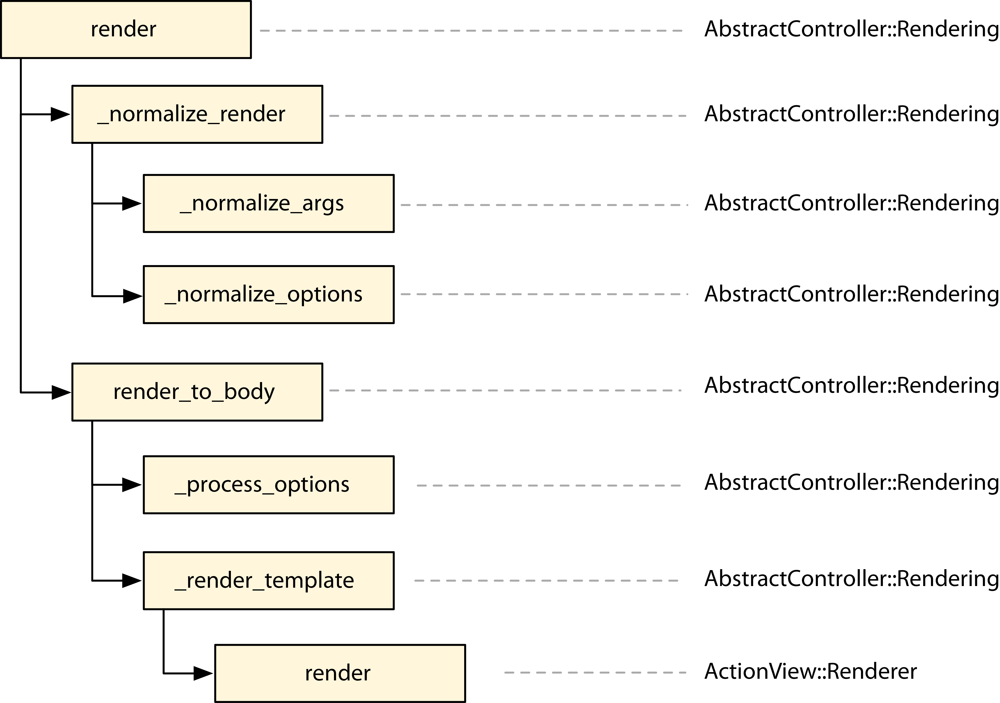
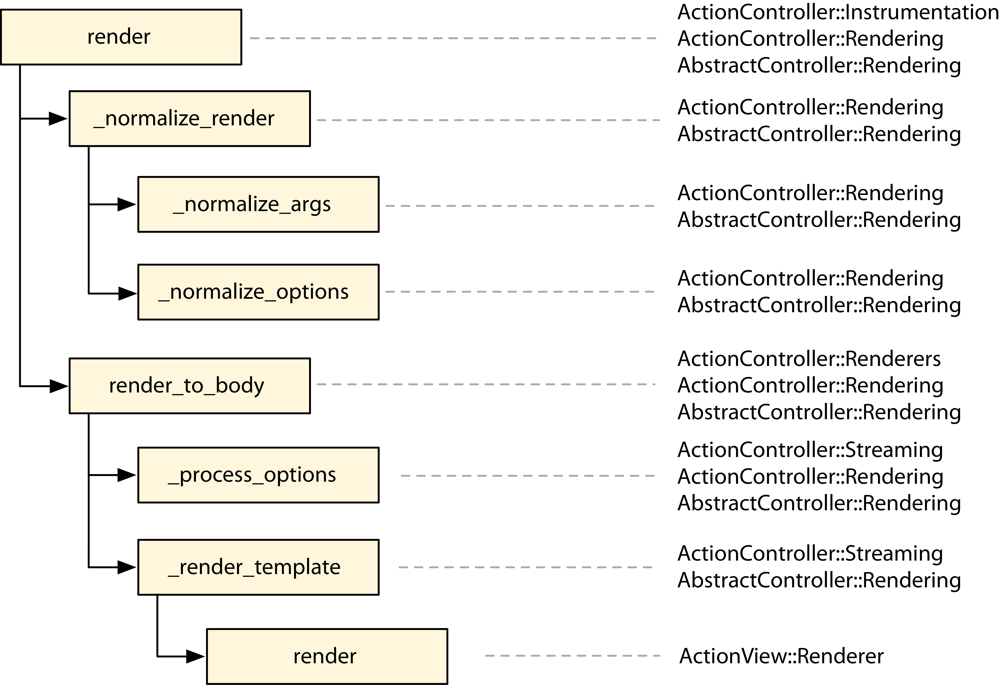

## Customizing Rails

### Adding custom renderer in Rails
1. How Rails implements a `renderer`:
```ruby
# in rails/actionpack/lib/action_controller/metal/renderers.rb
add :json do |json, options|
	json = json.to_json(options) unless json.kind_of?(String)
	if options[:callback].present?
		self.content_type ||= Mime::JS
		"#{options[:callback]}(#{json})"
	else
		self.content_type ||= Mime::JSON
		json
	end
end
```

So, whenever we invoke the following method in our application

`render json: @post`

it will invoke the block defined as the `:json renderer`. The local variable `json` inside the block points to the `@post` object, and the other `options` passed to `render()` will be available in the `options` variable. In this case, since the method was called `without any extra options`, it’s an `empty hash`.

In the following sections, we want to add a `:pdf` renderer that creates a PDF
document from a given template and sends it to the client with the appropriate
headers. The value given to the :pdf option should be the name of the file to
be sent.
The following is an example of the API we want to provide:
`render pdf: 'contents', template: 'path/to/template'`

2. Writing our controller to handle `.pdf` requests:

```ruby
class HomeController < ApplicationController
  def index
    respond_to do |format|
      format.html
      format.pdf { render pdf: "contents" }
    end
  end
end
```

3. Writing the actual renderer for handling `.pdf`
```ruby
require "prawn"
ActionController::Renderers.add :pdf do |filename, options|
    pdf = Prawn::Document.new
    pdf.text render_to_string(options)
    send_data(pdf.render, filename: "#{filename}.pdf",
    disposition: "attachment")
end
```

Now when we run our server from test/dummy, and request `localhost:3000/home.pdf`
We will get the `pdf` file.

But here we can note that we have not supplied `Content-Type` with
`application/pdf`. But Rails append that thing in the request.

The content type was set correctly because Rails ships with a set of registered
formats and MIME types:
We can check that in `rails/actionpack/lib/action_dispatch/http/mime_types.rb` file.
In this file we will have
```ruby
Mime::Type.register "multipart/form-data", :multipart_form
Mime::Type.register "application/x-www-form-urlencoded", :url_encoded_form
Mime::Type.register "application/json", :json,
%w(text/x-json application/jsonrequest)
Mime::Type.register "application/pdf", :pdf, [], %w(pdf)
Mime::Type.register "application/zip", :zip, [], %w(zip)
```

Notice how the PDF format is defined with its respective content type. When
we requested the /home.pdf URL, Rails retrieved the pdf format from the URL,
verified it matched with the `format.pdf` block defined in `HomeController#index` , and
proceeded to set the proper content type before invoking the block that called
`render`.

Going back to our render implementation, although `send_data()` is a public Rails
method and has been available since the first Rails versions, you might not
have heard about the `render_to_string()` method. To better understand it, let’s
take a look at the Rails rendering process as a whole.

## Understanding the Rails Rendering Stack

`Action Mailer` and `Action Controller` have several features in common, such
as `template rendering`, `helpers`, and `layouts`. To avoid code duplication, those
shared responsibilities are centralized in `Abstract Controller`, which both
`Action Mailer` and `Action Controller` use as their foundation. At the same time,
some features are required by `only one of the two libraries`. Given those
requirements, `Abstract Controller` was designed in a way that developers can
`cherry-pick` the functionality they want. For instance, if we want an object to
have basic `rendering capabilities`, where it simply `renders` a template but does
not `include a layout`, we include the `AbstractController::Rendering` module in our
object, leaving out `AbstractController::Layouts`.

When we include `AbstractController::Rendering` in an object, the rendering stack
proceeds as shown in below image every time we call
render() .


Each rectangle represents a `method`, followed by the classes or modules that
implement it. The `arrows` represent `method calls`. For example, `render()` calls
`_normalize_render()` and then calls `render_to_body()` . The stack can be confirmed by
looking at the `AbstractController::Rendering` implementation in `Rails source code`:

```ruby
# rails/actionpack/lib/abstract_controller/rendering.rb
def render(*args, &block)
    options = _normalize_render(*args, &block)
    self.response_body = render_to_body(options)
end

def _normalize_render(*args, &block)
    options = _normalize_args(*args, &block)
    _normalize_options(options)
    options
end

def render_to_body(options = {})
    _process_options(options)
    _render_template(options)
end
```

`Abstract Controller’s` rendering stack is responsible for `normalizing the
arguments` and `options` you provide and `converting` them to a hash of options
that `ActionView::Renderer#render()` accepts, which will take care of finally rendering
the template. Each method in the stack plays a specific role within this
overall responsibility. These methods can be either `private` (starting with an
underscore) or part of the `public API`.

The first relevant method in the stack is `_normalize_args()` , invoked by `_normalized_render()`,
and it converts the `user-provided arguments` into a `hash`. This
allows the `render()` method to be invoked as `render(:new)` , which `_normalize_args()`
converts to `render(action: "new")`.

The hash that `_normalize_args()` returns is then further `normalized` by 
`_normalize_options()` . There is not much normalization happening inside 
`AbstractController::Rendering#_normalize_options()` since it’s the basic
module, but it does convert `render(partial: true)` calls to `render(partial: action_name)` .
So, whenever you give `partial: true` in a `show()` action, it becomes `partial: "show"`
down the stack.

After normalization, `render_to_body()` is invoked. This is where the actual `rendering` starts. 
The first step is to `process all options` that are `meaningless` to the
view, using the `_process_options()` method. Although `AbstractController::Rendering#_process_options()` 
is an empty method, we can look into `ActionController::Rendering#
_process_options()` for a handful of examples about what to do in this method.

For instance, in controllers we are allowed to invoke the following:

`render template: "shared/not_authenticated", status: 401`

Here the `:status` option is `meaningless` to views, since `status` refers to the `HTTP`
`response status`. So, it’s `ActionController::Rendering#_process_options() ’s` responsibility
to intercept and handle this option and others.

After options processing, `_render_template()` is invoked and different objects start
to collaborate. In particular, an instance of `ActionView::Renderer` called `view_renderer`
is created and the `render()` method is called on it with two arguments: the
`view_context` and our hash of normalized `options` :

```ruby
# rails/actionpack/lib/abstract_controller/rendering.rb
view_renderer.render(view_context, options)
```

The view context is an instance of `ActionView::Base` ; it is the `context` in which
our `templates` are `evaluated`. When we call `link_to()` in a template, `it works`
because it’s a `method available` inside `ActionView::Base` .

When `instantiated`, the `view context` receives `view_assigns()` as an argument. 
The term `assigns` references the `group of controller variables` that will be 
`accessible in the view`. By default, whenever you set an `instance variable` in 
your controller as `@posts = Post.all` ,`@posts` is `marked` as an `assign` and 
will also be available in views.

**Note**:
At this point, it’s important to highlight the `inversion of concerns` that 
happened between `Rails 2.3` and `Rails 3.0`. In the former the `view is responsible`
for `retrieving assigns from the controller`, and in the latter the `controller tells
the view which assigns to use`.

Imagine that we want a `controller` that `does not` send any `assigns` to the view.
In `Rails 2.3`, since the `view automatically pulls in all instance variables` from
controllers, `to achieve that` we should either `stop using instance variables` in
our controller or `be sure to remove all instance variables` before rendering a
template. In `Rails 3 and up`, this `responsibility is handled` in the `controller`.
We just need to `override` the `view_assigns()` method to return an empty hash:

```ruby
class UsersController < ApplicationController
    protected
    def view_assigns
        {}
    end
end
```

By returning an empty hash, we ensure none of the actions in the controller
pass assigns to the view.

With the `view context` and the `hash of normalized options` in hand, our
`ActionView::Renderer` instance has everything it needs to `find a template`, based
on the options, and finally `render it inside the view context`.

**Note**:
This modular and well-defined stack allows anyone to hook into the `rendering
process` and add their own features.

When we include `AbstractController::Layouts`
on top of `AbstractController::Rendering` , the `rendering stack` is extended as shown
in below image:


`AbstractController::Layouts` simply overrides `_normalize_options()` to support 
the `:layout` option. In case `no :layout option` is set when calling `render()` , 
one may be `automatically` set based on the `value a developer configures at the controller class
level`. `Action Controller` further `extends the Abstract Controller rendering
stack`, adding and processing options that `make sense` only in the `controller
scope`.

Those extensions are broken into four main modules:

1. `ActionController::Rendering` : Overrides `render()` to check if it’s ever `called twice`,
raising a `DoubleRenderError` if so; also overrides `_process_options()` to handle
options such as `:location` , `:status` , and `:content_type`

2. `ActionController::Renderers` : Adds the `API` `we used here`, which allows
us to `trigger` a `specific behavior` whenever a given key (such as `:pdf` ) is
supplied

3. `ActionController::Instrumentation` : Overloads the `render()` method so it can measure
`how much time` was spent in the `rendering stack`

4. `ActionController::Streaming` : Overloads the `_process_options()` method to handle the
`:stream` by setting the proper `HTTP headers` and the `_render_template()` method
to allow `templates to be streamed`.




Now that we understand how the `render()` works, we are ready to understand
how `render_to_string()` works. Let’s start by seeing its definition in `AbstractController::Rendering` :
```ruby
# rails/actionpack/lib/abstract_controller/rendering.rb
def render_to_string(*args, &block)
    options = _normalize_render(*args, &block)
    render_to_body(options)
end
```

At first, the `render_to_string()` method looks quite similar to `render()` . 
The only difference is that `render_to_string()` does not `store the rendered template` as 
the response body. However, when we analyze the whole rendering stack, we see
that some `Action Controller modules` overload `render()` to add behavior while
leaving `render_to_string()` alone.

For instance, by using `render_to_string()` in our `renderer`, we ensure 
`instrumentation` events defined by `ActionController::Instrumentation` won’t 
be triggered `twice` and won’t raise a `double render error` since those 
functionalities are added only to the `render()` method.

In some other cases, `render_to_string()` may be `overloaded`, as well. When using `Action
Controller`, the `response body` can be another object that is not a string, which is
what happens on `template streaming`. For this reason, `ActionController::Rendering`
overrides `render_to_string()` to always return a `string`, as the name indicates.


## Further:

Going back to our renderer implementation, we now understand what happens
when we add the following line to our controllers:

```ruby
format.pdf { render pdf: "contents" }
```

In our renderer, it becomes this:

```ruby
pdf = Prawn::Document.new
pdf.text render_to_string({})
send_data(pdf.render, filename: "contents.pdf",
    disposition: "attachment")
```

When we invoke `render_to_string()` with an `empty hash`, the `_normalize_options()`
method in the rendering stack detects the `empty hash` and `changes` it to
`render the template with the same name as the current action`.
At the end, `render_to_string({})` simply passes `template: "#{controller_name}/#{action_name}"` 
to the `view-renderer` object.


The fact that our renderer relies on `render_to_string()` allows us to 
also use the following options:
```ruby
render pdf: "contents", template: "path/to/template"
```

And internally, the preceding code is the same as the following:
```ruby
pdf = Prawn::Document.new
pdf.text render_to_string(template: "path/to/template")
send_data(pdf.render, filename: "contents.pdf",
    disposition: "attachment")
```

This time `render_to_string()` receives an explicit template to `render`. 
To finish our PDF renderer, let’s add a test to confirm that the chosen 
template will indeed be rendered. Our test invokes a new action 
in HomeController that calls `render()` with both `:pdf` and `:template` options:

```ruby
# pdf_renderer/2_final/test/dummy/app/controllers/home_controller.rb
def another
    render pdf: "contents", template: "home/index"
end
```

Let’s add a route for this new action:
```ruby
# pdf_renderer/2_final/test/dummy/config/routes.rb
get "/another", to: "home#another", as: :another
```

Our test simply accesses "/another.pdf" and ensures a PDF is being returned:
```ruby
# pdf_renderer/2_final/test/integration/pdf_delivery_test.rb
test "pdf renderer uses the specified template" do
    get another_path(format: :pdf)
    assert_match "PDF", response.body
    assert_equal "binary", headers["Content-Transfer-Encoding"]
    assert_equal "attachment; filename=\"contents.pdf\"",
        headers["Content-Disposition"]
    assert_equal "application/pdf", headers["Content-Type"]
end
```

## Wrap Up
In this chapter we created a renderer for the PDF format. Using these ideas,
you can easily create renderers for formats such as CSV and ATOM and
encapsulate any logic specific to your application in a renderer, as well. You
could even create a wrapper for other PDF libraries that are able to convert
HTML files to PDF, such as the paid Prince XML library or the open source
Flying Saucer, which is written in Java but is easily accessible through
JRuby. 5,6,7
We also discussed the Rails rendering stack and its modularity. As Rails itself
relies on this well-defined stack to extend Action Controller and Action Mailer,
it makes the rendering API more robust; it was battle-tested by Rails’s own
features and various use cases. As we’ll see in the chapters that follow, this
is a common practice throughout the Rails codebase.
Rails’s renderers open several possibilities to extend your rendering stack.
But as with any other powerful tool, remember to use renderers wisely.